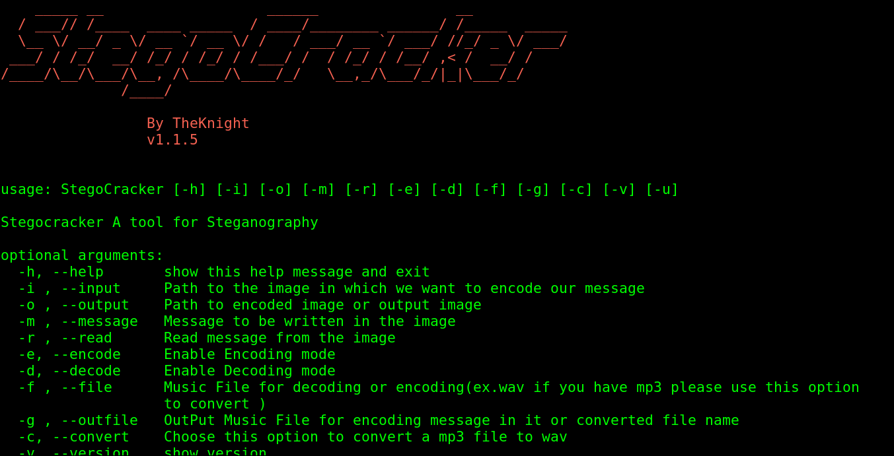
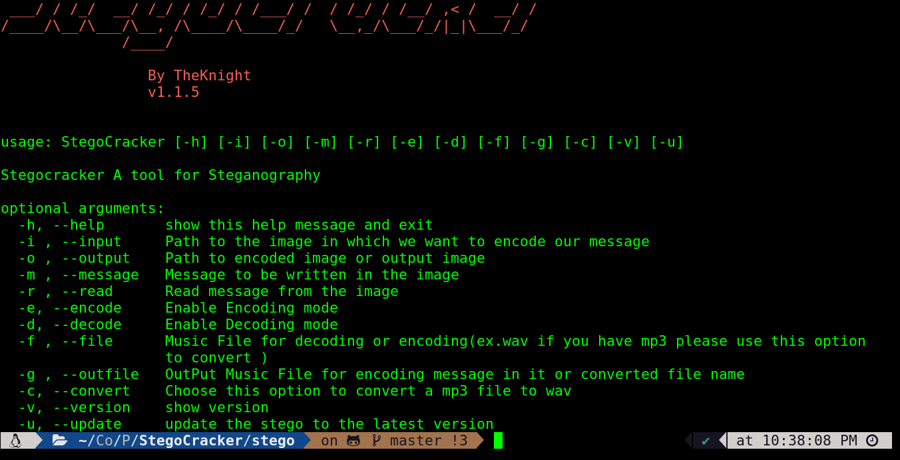
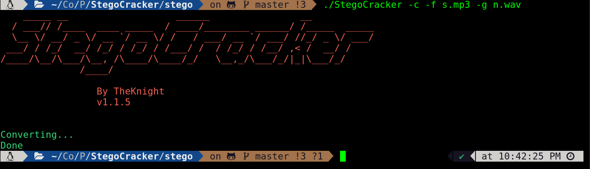
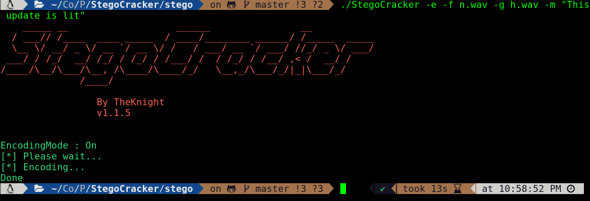
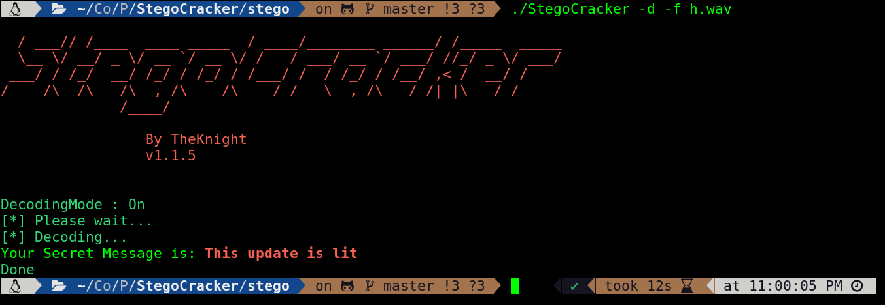

<p align="center">

                               [](https://shields.io/) 
[](https://github.com/W1LDN16H7)


	
[](https://www.python.org/)
[](https://github.com/ellerbrock/open-source-badges/)
[](https://www.gnu.org/software/bash/)

[](https://opensource.org/licenses/Apache-2.0)

</p>

#                                                      Welcome To StegoCracker Home :house:
<br>
<br>
<p align="center">
	
</p>
<br>
<p align="center">
	
</p>
<br>


#### What is steganography

Steganography is the art of hiding a secret message within a normal message. This is used to transfer some secret message to another person; with this technique, no one else in between will know the secret message you wanted to convey.

This art of hiding secret messages has been used for years in real-life communications. Since the evolution of digital communication, it has also been used in digital conversations.

This software can hide your secret message behind the image file, wav file, mp3 file and  many other file format will support
in future soon if you will contribute it will be good to me thanks


#### What is Stego

<p align="center">
	
</p>
<br>

**Stego is an open-source and free steganography tool that lets you hide your secret message in an image or audio file. You will not notice any change in the image or audio file. However, your secret file will be inside the original image or audio file.**

**This is command-line tool. Therefore, you need to learn the commands to use the tool. Commands will be used to embed files in the image or audio file. In addition, to extract your file from the image or audio file, you need to use another command.**


# Installation
**Stego** is written in python3 so you need python3 to use it 

First clone the repo and follow 
the given step
```

git clone https://github.com/W1LDN16H7/StegoCracker.git 
```
Change the dir to Stego

```
cd Stego
```
Run setup.py  with python3 to install all the dependencies

```
python3 setup.py install 
```

Or you can install manually 

```
python3 -m pip install -r requirements.txt 
```
After all that done run install.sh file in your terminal

```
chmod +x install.sh && ./install.sh 
```

Now it's all done 

You can check it by running from anywhere in the terminal

```
stego -h 
```

Congratulation you have installed the stego

<p align="center">
	
</p>
<br>


# Usage

### Working with audio files

- Convert mp3 to wav

If you want to hide a secret message in a audio file, but it's a mp3 file,
than you should use a stego -c feature to convert it into a wav file

let's see

```
stego -c -f s.mp3 -out 26.wav 
```

A new file named 26.wav will generate, and you can go further
<p align="center">
	
</p>
<br>

- Encoding Message in wav file

For hiding the message or data in wav file you need to
run the command like this

```
stego -f 23.wav -out 24.wav -m "hello this is stego" -e 
```

<p align="center">
	
</p>
<br>

as you can see it's done.Now we will try to decode the message.


- Decoding Message from an audio file

For decoding the data you need to have a wav file and turn the stego's decode mode on.

```
stego  -d -f 24.wav
```
<p align="center">
	
</p>
<br>

Wow we get the same message 

### Working with image files
As we saw we encoded tha data in audio files now we will use stego 
to encode the data in images

As we know the stego only support png,jpeg format till now
but in future I will extend the support to some other file format.
But if you can do this it will be amazing to everyone please contribute
if you're interested in it,extend the features.

- Encode message in image file
```
stego - i c.png -o out.png -e -m "Hello this is stego blah blah" 
```

<p align="center">
	
</p>
<br>
Now it'll encode all the given data in that image and you'll see that there isn't any differance
In the image file

- Decoding data from the image files

For decoding use it like this..

```
stego -d  -r out.png 
```

<p align="center">
	
</p>
<br>
We got the same result.


# Disclaimer

It is the end user's responsibility to obey all applicable local, state, federal, and international laws.
Developers assume no liability and are not responsible for any misuse or damage caused by this program.


- [X] Please Contribute


# License

License can be read [here](https://github.com/W1LDN16H7/StegoCracker_v1.1.0/blob/master/LICENSE)
