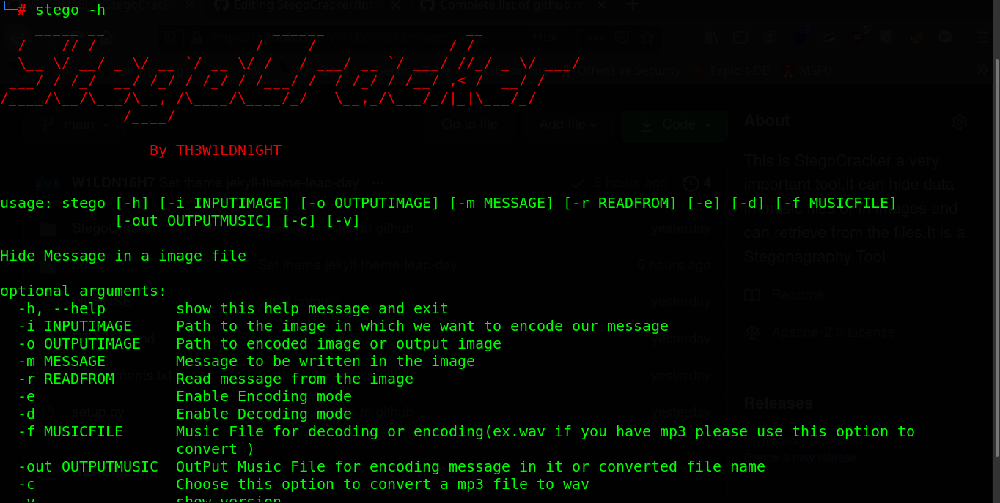

#### Welcome To StegoCracker Home :house:

<p align="center">
	
</p>
<br>


#### What is steganography

Steganography is the art of hiding a secret message within a normal message. This is used to transfer some secret message to another person; with this technique, no one else in between will know the secret message you wanted to convey.

This art of hiding secret messages has been used for years in real-life communications. Since the evolution of digital communication, it has also been used in digital conversations.

This software can hide your secret message behind the image file, wav file, mp3 file and  many other file format will support
in future soon if you will contribute it will be good to me thanks


#### What is Stego

<p align="center">
	
</p>
<br>

**Stego is an open-source and free steganography tool that lets you hide your secret file in an image or audio file. You will not notice any change in the image or audio file. However, your secret file will be inside the original image or audio file.**

**This is command-line tool. Therefore, you need to learn the commands to use the tool. Commands will be used to embed files in the image or audio file. In addition, to extract your file from the image or audio file, you need to use another command.**


You can use the [editor on GitHub](https://github.com/W1LDN16H7/StegoCracker/edit/main/docs/index.md) to maintain and preview the content for your website in Markdown files.

Whenever you commit to this repository, GitHub Pages will run [Jekyll](https://jekyllrb.com/) to rebuild the pages in your site, from the content in your Markdown files.

### Markdown

Markdown is a lightweight and easy-to-use syntax for styling your writing. It includes conventions for

```markdown
Syntax highlighted code block

# Header 1
## Header 2
### Header 3

- Bulleted
- List

1. Numbered
2. List

**Bold** and _Italic_ and `Code` text

[Link](url) and 
```

For more details see [GitHub Flavored Markdown](https://guides.github.com/features/mastering-markdown/).

### Jekyll Themes

Your Pages site will use the layout and styles from the Jekyll theme you have selected in your [repository settings](https://github.com/W1LDN16H7/StegoCracker/settings/pages). The name of this theme is saved in the Jekyll `_config.yml` configuration file.

### Support or Contact

Having trouble with Pages? Check out our [documentation](https://docs.github.com/categories/github-pages-basics/) or [contact support](https://support.github.com/contact) and we’ll help you sort it out.
